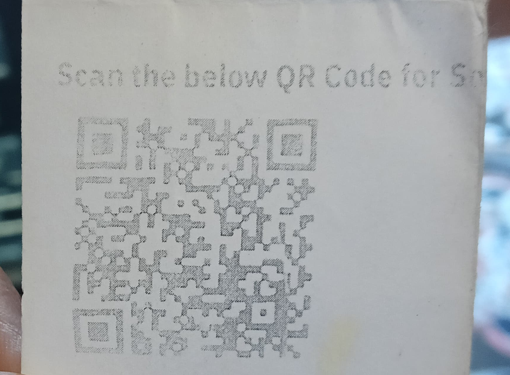

# QRFx - finding the best way to waste my time
## not a waste of time though, learnt a lot but... a project but only customized for my use case.
this project is not made to fix *any* broken qr image.  
i haven't taken generalization of the algo into consideration. I solely made this project to fix a qr code (single) I already had which wasn't working.  

> original QR code, doesn't work.   

i had this qr code lying around since a few **years**... yes i had a plan to recover it since then, i was given an opportunity to do any project and implement anything for a thing i applied, so i decided to proceed with this, and i surprisingly picked up opencv quite well in just 5 days and got the qr code working.
## technical specifications

### what i tried
i tried gaussian blur, simple blur using kernels, filters, bilateral filtering, binarization, canny edge detection, gap filling, contours, flood fill, otsu threshold too. 

> this one above works, and is scannable.

### actual current pipeline (for locating it manually)
#### these all steps are written for me to try to get an algorithm made for detecting a qr code's location in an image.
* input (source.png) image gets read in grayscale  
* gaussian blur is applied 5 times
* the output gets binarized with 170 threshold 
* then canny edge detection is applied on the binarized image
* then a custom algo spots right angles to try and detect a qr code in the inputted image. (and cropping it)  
we can crop a qr code if we just get 2 out of 3 finder patterns detected.

future additions can be then digitizing the qr code with contour polygon approximations overlayed and converting it to the nearest polygons possible and getting a decent qr code. just for the fun, I don't think it has any practical uses.
# ALSO, please don't judge my coding skills with this (they are way worse /s), i write trash code but ay atleast it works, i skipped on the documentation part because no one else is gonna use this abomination of a code apart from me.
